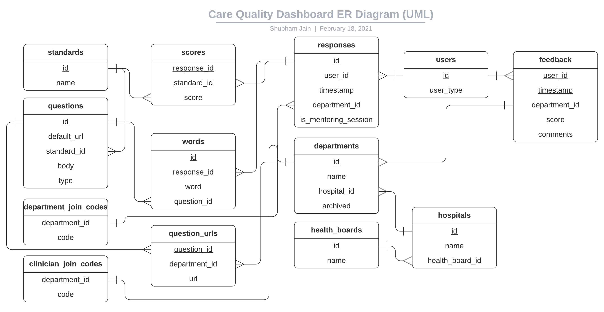

# Architecture

The Care Quality Dashboard is a Next.js application. The following is a system architecture diagram showing a high-level overview of the various parts and how they are connected together:


The entire system is containerised via Docker. You can find the web-app Dockerfile at [`./Dockerfile`](./Dockerfile), and the system's Docker Compose configuration at [`./docker-compose-prod.yml`](./docker-compose-prod.yml).

The system's backend consists primarily of Next.js API routes to create a REST API that is consumed by the React-based frontend.

**The REST API documentation exists in the form of an [OpenAPI 3 (Swagger) specification](https://swagger.io/specification/). The JSON specification can be found [here](https://github.com/UCLComputerScience/COMP0016_2020_21_Team20/blob/gh-pages/care-quality-dashboard-api.json), and the rendered documentation can be found [here](https://uclcomputerscience.github.io/COMP0016_2020_21_Team20/backend/).**

**The frontend documentation exists as JSDoc in the source code, and a [Docz](https://docz.site/)-rendered component-level documentation which can be found [here](https://uclcomputerscience.github.io/COMP0016_2020_21_Team20/frontend/).**

Keycloak is used as the identity and access management tool, with a single instance hosted alongside the web-app. NextAuth.js facilitates interaction between the web-app and the Keycloak OpenID Connect interface. In addition, various API routes internally use the Keycloak Admin REST API to interact with Keycloak when certain actions are performed.

The system contains 2 PostgreSQL databases, both within a single dockerised PostgreSQL instance: `care_quality_dashboard` and `keycloak`:

- The `keycloak` database is entirely managed by Keycloak in the Keycloak Docker Container
- The `care_quality_dashboard` database is the system's own database storing information such as responses, questions, departments, hospitals, etc. An ER-UML diagram is below:

  

Prisma is used as an ORM to communicate with the `care_quality_dashboard` database; the Prisma schema can be found at [`./prisma/schema.prisma`](./prisma/schema.prisma).

**Note: Secret environment variables should stored in a `.env` file in the root of the project. See [`.env.example`](./.env.example) as a template for this.**

The rest of this document explains the configuration and functioning of each core component in further detail.

## Keycloak (identity and access management)

Keycloak is configured as a standalone server running in a Docker container on the same machine. It is **not** in cluster mode, due to the unneccessary complexity for the low-scale usage of the system.

The administrator username and password should be configured via the Docker Compose file using the `KEYCLOAK_USER` and `KEYCLOAK_PASSWORD` environment variables.

Keycloak is configured to use the following Realm-level roles, in a sort-of hierarchy:

- `clinician`
- `department_manager`
- `hospital`
- `health_board`
- `platform_administrator`

It is intended that a given user should have **at most one** of `clinician`, `department_manager`, `hospital`, or `health_board` roles, and in addition they may or may not have the `platform_administrator` role -- e.g., a user could be a clinician and platform administrator, but not a clinician and health board.

**No** identity providers have been configured via identity brokering. It is hoped that this could be used if an official NHS login system is used for the platform, as it can be simply connected to the same Keycloak instance via OpenID connect or SAML.

The realm `care_quality_dashboard` has been configured to allow "emails as username" and "login with email". SSL is required for external requests.

A single custom client has been created: `care_quality_dashboard_web`. This is a `public` and `openid-connect` client, with the standard flow **enabled**. These settings are crucial to ensure the NextAuth.js integration works with the Keycloak instance.

All the described settings above are available in a secret JSON file that can be imported into a Keycloak instance via the UI or using the `KEYCLOAK_IMPORT` environment variable through the Docker Compose file.

## NextAuth.js

NextAuth.js facilitates the communication and authentication between the web-app and the Keycloak instance. This is done via the use of OpenID Connect (OAuth 2.0).

NextAuth should be configured in the [`./pages/api/auth/[...nextauth].js` file](./pages/api/auth/[...nextauth].js). At the time of development, an official generic OAuth provider does not exist in NextAuth.js, therefore a custom provider must be used. Below is the current custom provider being used:

```js
{
    id: 'keycloak',
    name: 'Keycloak',
    params: { grant_type: 'authorization_code' },
    scope: 'openid roles',
    type: 'oauth',
    version: '2.0',
    accessTokenUrl: `${config.KEYCLOAK_BASE_AUTH_URL}/token`,
    authorizationUrl: `${config.KEYCLOAK_BASE_AUTH_URL}/auth?response_type=code`,
    clientId: process.env.CLIENT_ID,
    profileUrl: `${config.KEYCLOAK_BASE_AUTH_URL}/userinfo`,
    profile: profile => {
        return {
            id: profile.sub,
            name: profile.preferred_username,
        };
    },
}
```

Importantly, the grant type must be `authorization_code`, as this is the authentication method being used. Moreover, the `response_type=code` query parameter must be used in the `authorizationUrl` to ensure the grant type is being used correctly.

Including the `roles` scope is useful to determine which users have what roles.

### Authentication workflow

As Keycloak is the central authentication management system for the platform, minimal user information is stored in the `care_quality_dashboard` database itself (only the user IDs and type). Consequently, the system must interact with Keycloak via the [Keycloak Admin REST API](https://www.keycloak.org/docs/latest/server_development/#admin-rest-api) -- all actions that can be performed through the Keycloak Admin Console (UI) can also be performed through this Admin REST API.

The Keycloak Admin REST API should only ever be used when running code on the server-side (i.e. on API routes, not client side). This is because admin credentials are required (they will be in your `.env` file) to generate an admin access token for use in the Admin REST API requests.

The authentication workflow currently looks like:

1. User clicks login button
2. User enters credentials on Keycloak auth page
3. User redirected back to app
4. NextAuth.js `signIn` callback called (see [source](https://github.com/UCLComputerScience/COMP0016_2020_21_Team20/blob/89897c0cdb4c909e16b4103c9578c72e52e84ffd/pages/api/auth/%5B...nextauth%5D.js#L69-L72))
   This callback checks to see if the user's department is marked as `archived` in the database (if it has been archived/deleted since they last used the platform). If it is, they are redirected to the homepage and a message is shown to them. Their role and department ID are also updated/deleted in Keycloak through its Admin REST API.
5. NextAuth.js `signIn` event called (see [source](https://github.com/UCLComputerScience/COMP0016_2020_21_Team20/blob/89897c0cdb4c909e16b4103c9578c72e52e84ffd/pages/api/auth/%5B...nextauth%5D.js#L75-L77)).
   This callback is triggered when the user successfully signs in. This callback ensures that the user's ID and type is stored inside the `care_quality_dashboard` database itself. This is neccessary because user responses etc. are tied to their ID, so they must be present in the database to use the system. In addition, this callback checks to see whether the user's Keycloak roles have been updated since they last logged in -- and then updates the `care_quality_dashboard` database with this information too.
6. Platform uses `session` object throughout
   This `session` object is populated through the NextAuth.js `session` callback (see [source](https://github.com/UCLComputerScience/COMP0016_2020_21_Team20/blob/89897c0cdb4c909e16b4103c9578c72e52e84ffd/pages/api/auth/%5B...nextauth%5D.js#L43-L68)), and ensures that the data is up-to-date from Keycloak whenever the `session` object is checked throughout the codebase. Data added here that comes from Keycloak includes `userId`, `departmentId`, `hospitalId`, `healthBoardId`, and the user `roles`.
7. User signs out
   NextAuth.js' `signOut` event is triggered (see [source](https://github.com/UCLComputerScience/COMP0016_2020_21_Team20/blob/89897c0cdb4c909e16b4103c9578c72e52e84ffd/pages/api/auth/%5B...nextauth%5D.js#L79-L82)), and the local cookie is deleted. On top of this, the event callback destroys the Keycloak session via the Admin REST API to ensure the user isn't automatically logged back in when they next click 'sign in'.

All the user authentication event-related handlers can be found in [`./lib/handleUserAuthEvents.js`](./lib/handleUserAuthEvents.js).

## Prisma (database ORM)

All database interactions are performed solely through Prisma, as it provides type enforcement and simplifies the development experience.

You must ensure to run `npx prisma generate` on first use of the project, and on every database change thereafter. This command will generate the Node Prisma Client that is used throughout the project.

The Prisma Client is generated through the [Prisma Schema file](./prisma/schema.prisma). This file must be kept up to date with the main database schema -- this can be done via the `npx prisma db pull` command to read your current local database schema and update the Prisma schema.

To use Prisma in the codebase, simply `import prisma from 'lib/prisma'`;
