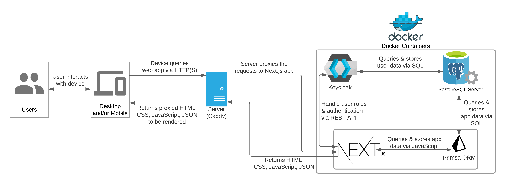
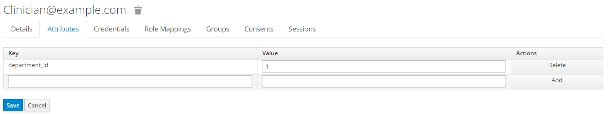

# Care Quality Dashboard

The Care Quality Dashboard is an online platform for clinicians in NHS Wales to measure themselves against the [Welsh Government's Health and Care Standards](http://www.wales.nhs.uk/governance-emanual/health-and-care-standards).

The aim is to encourage open conversations through the use of regular online self-reports answering short questions (mostly Likert-scale based) relating to each of the 7 Standards.

This repository contains the entire source code for the project, which is currently deployed on a [Linode VPS](https://linode.com/) through Docker.

This project was built as part of the [UCL Industry Exchange Network (IXN)](https://www.ucl.ac.uk/computer-science/collaborate/ucl-industry-exchange-network-ucl-ixn) in the academic year 2020-2021 by [Shubham Jain](https://sjain.dev), [Mateusz Zielinski](https://github.com/mateuszz7) and [Matthieu Schulz](https://matthieuschulz.me/).

The project's comprehensive Development Blog [can be found here](https://comp0016-team-20.github.io/blog/) for details on design decisions and weekly progress updates for the duration of the project.

The project's report website [can be found here](http://students.cs.ucl.ac.uk/2020/group20/) with an overview of the project and it's details.

The project's user manual [can be found here](https://liveuclac-my.sharepoint.com/:w:/g/personal/zcabmzi_ucl_ac_uk/EXJNiRz5slBPv0KfCFdaep4BEiiZumxu2SwkeFsuEx_RGg?e=cYTzgn).

See also [`ARCHITECTURE.md`](./ARCHITECTURE.md) and [`DEPLOYMENT.md`](./DEPLOYMENT.md) for further information on the system architecture and deployment procedures.

Prettier and ESLint enforce code style for this project. There is a pre-commit hook to auto-format code.

## Project Structure and Architecture

This is a Next.js app:

- frontend pages belong in [`./pages/`](./pages)
- React components belong in subfolders in [`./components/`](./components) and should be re-exported in [`./components/index.js`](./components/index.js)
  - all components are documented through [Docz](https://www.docz.site/), and are in the form of a `ComponentName.mdx` file in their respective folder
  - all components are unit-tested through [Enzyme](https://enzymejs.github.io/enzyme/), and are in the form of a `ComponentName.test.js` file in their respective folder
  - components have CSS module files for their styling (if applicable), and are in the form of a `ComponentName.module.css` file in their respective folder
- backend API routes belong in [`./pages/api/`](./pages/api)
  - all backend API routes are documented inline using JSDoc with YAML OpenAPI syntax
- static files belong in [`./public`](./public)
- project-specific and shared library files belong in [`./lib`](./lib)
- backend API integration tests belong in [`./test/api`](./test/api)
- platform end-to-end tests belong in [`./test/end-to-end`](./test/end-to-end)

A System Architecture diagram is below:



See [ARCHITECTURE.md](./ARCHITECTURE.md) for more details on the architecture.

### Project tree

The following tree shows the main files and folders in the repository, and their use:

```
.
├── .github/                 # GitHub-specific files, e.g. GitHub Actions Workflows for Continuous Integration/Deployment
├── .vscode/                 # Visual Studio Code common configuration for development
├── components/              # React components for the web-app front-end, along with their tests and documentation
│   ├── Accordion/
│   ├── AlertDialog/
│   ├── ...
├── docs/                    # Documentation specific files for this GitHub repository (e.g. images included in the README)
├── keycloak/                # Configuration files for the Keycloak Docker Container
├── lib/                     # Project-specific helper/constant/etc. files
├── pages/                   # Next.js page routes. Each file corresponds to a public URL path
│   └── api/                 # Next.js API routes. Each folder/file corresponds to a public API endpoint
│       ├── auth/
│       └── questions/
│       └── ...
├── prisma/                  # Prisma (ORM) schema and helper files
└── public/                  # Static assets for use in the web-app front-end
└── test/                    # End-to-end and API integration tests for the platform
└── .babelrc                 # Babel JS Compiler project configuration
└── .env.example             # Example .env enviroment file (a .env file is required for development/deployment)
└── .env.test                # .env enviroment file required for tests
└── .eslintrc.json           # Project ESLint configuration for enforced code style
└── .prettierrc              # Project Prettier configuration for enforced code style
└── *.md                     # Documentation files for this GitHub repository
└── Caddyfile                # Caddy server configuration for production web-app
└── docker-compose*.yml      # Docker Compose configurations for various enviroments
└── Dockerfile               # Web-app Dockerfile
└── doczrc.js                # Docz (frontend documentation) configuration file
└── gatsby-node.js           # Docz (frontend documentation) Gatsby configuration file
└── jest*.js                 # Jest (test-runner) configurations for various tests
└── next.config.js           # Configuration file for this Next.js app
└── openapi-generator.js     # Configuration file for openapi-generator (to generate OpenAPI specification for backend REST API)
└── package.json             # Node.js package configuration for platform
└── setup-db.sh              # Helper bash script to set up databases in Docker Container
└── schema.sql               # SQL Schema file for project database
```

## Development

### Requirements

Please ensure you have [Node.js](https://nodejs.org/en/), [Docker](https://www.docker.com/), [Docker Compose](https://docs.docker.com/compose/), and [npm](https://www.npmjs.com/get-npm) installed on your machine before proceeding with development.

### Configuration

You will need to configure some secrets/configuration settings: place a `.env` file in the project root, based off the [`.env.example`](./.env.example) file, replacing the relevant placeholders with an appropriate value. For passwords, you could just use something like `dev` if running locally.

To run tests, you will also need to update the [`.env.test`](./.env.test) file with passwords you configured in `.env` (e.g. your PostgreSQL and Keycloak passwords).

At the moment, you also need a secret Realm file for Keycloak. Get the `care_quality_dashboard_realm.json` secret file from Shubham, and place this into a folder called `keycloak` in your project root (i.e. `./keycloak/care_quality_dashboard_realm/json`).

### Developing locally

- Clone this repository to your machine (see [the GitHub docs](https://docs.github.com/en/github/creating-cloning-and-archiving-repositories/cloning-a-repository) for more information)
- Run `npm install` to install all the Node.js dependencies
- Run `npx prisma generate` to generate the Prisma client
- Run `docker-compose up [-d]` to start the Keycloak and PostgreSQL Docker containers locally (`-d` optionally runs the containers in detached mode, i.e. in the background)
- Run `npm run dev` to start the web-app in development mode on `localhost:3000` -- hot reloading is enabled by default
- Run `npm run build` to build the project followed by `npm run start` to run the built project (this is generally only needed in production/deployment)

### Seeding the database

If you're running this project for the first time, or have reset your database, you will need to seed it with some initial data:

1. Run `node prisma/seed.js` from the root project directory.

Now your database should be running with some initial data!

You might also want to seed some dummy responses for the new user (note: this must be done **after** you have created users -- see the next section):

1. Ensure you have logged in as the user you want to seed the responses for on your local server (i.e. at <localhost:3000>). This is needed so that the User ID is added to our database, which only happens on the first login. **You'll get an error about no matching parent ID for nested inserts if you don't do this first!**

2. Run `node prisma/seedResponses.js USER_ID`, replacing `USER_ID` with the new user's ID, which you can copy from Keycloak.

Now your database should have some initial fake data for the given user!

### Creating users

To create users (e.g. to make some test users to play around with locally), use the Keycloak web interface:

1. Go to <http://localhost:8080> and login to the administrative console

   Use `admin` and the password you set in your `.env` file as the login details

2. On the left hand side, find `Users`
3. Add a new user and set an email

   

4. Once you add the user, go back to the user and edit the "Role Mappings": add clinician/department/etc to it

   

5. Also, set a password under "Credentials" (make sure it's **NOT** temporary)

   

6. (optional) Add a `department_id` (for clincians/department managers), `hospital_id` (for hospital users), or `health_board_id` (for health board users) to their "attributes", matching the ID of their corresponding department/hospital/health board

   

### Database

We use [Prisma](https://www.prisma.io/) as an ORM to interact with a [PostgreSQL database](http://postgresql.org/).

The SQL Schema can be found in [`schema.sql`](./schema.sql).

Make sure you have a `.env` file in the project root with a `DATABASE_URL` variable set to the [PostgreSQL connection URL](https://www.prisma.io/docs/concepts/database-connectors/postgresql) for your local database (running in Docker).

If you've made a change to the database [`schema.sql`](./schema.sql), you'll need to 'pull' the PostgreSQL database schema and generate a new Prisma Schema (note in earlier version of Prisma, this command was called `prisma introspect` -- they are the same thing!):

```bash
npx prisma db pull
```

This should update the [`./prisma/schema.prisma`](./prisma/schema.prisma) file, based on the SQL database schema.

You should then run the database migrations, using Prisma Migrate:

```bash
npx prisma migrate dev --preview-feature
```

This will ask you to name the migration, so give it a short but concise name using `snake_case`.

Finally, to generate the Prisma Client, for use in our code, run:

```bash
npx prisma generate
```

This will generate the database-specific Prisma Client into `./node_modules/.prisma`.

Note: if you're pulling migrations made by another developer, you can just run:

```bash
npx prisma migrate dev --preview-feature
```

to apply the migrations on your local database!

See the [Prisma docs](https://www.prisma.io/docs/) for more detailed information and the API reference.

## Testing

This project uses [Jest](https://jestjs.io/) as the test framework for all tests.

There are currently 3 types of test suites:

- Frontend Component Unit Tests
- Backend REST API Integration Tests
- Entire System End-to-End (E2E) Tests (and Compatibility Testing)

These are described below in more detail.

### Frontend Component Unit Tests

These tests use [Enzyme](https://enzymejs.github.io/enzyme/) to test individual components in the [`./components`](./components) folder. Each test should be as small as possible, and should check that the components mount, and perform as required.

Some components will use the API, so this isn't tested in these tests.

These tests should be added within each component's directory, in the format `ComponentName.test.js`. See any of the existing tests in the `components` folder for examples.

See the GitHub Actions CI workflow for running these tests: [`./.github/workflows/test-frontend.yml`](./.github/workflows/test-frontend.yml).

**To perform these tests, run `npm run test:frontend`**.

### Backend REST API Integration Tests

These tests use a custom Jest Test enviroment found at [`./test/api/api-test.environment.js`](./test/api/api-test.environment.js) to test each REST API endpoint from the [`./pages/api`](./pages/api) directory.

The custom Jest Test environment performs essential setup tasks (destroying and recreating the database schema, seeding initial basic data to it), and teardown tasks (destroying the database schema), so that each test suite (file) runs in it's own environment, meaning the database data is 'fresh' each time.

These tests should be checking that the integration all the way from the network-level to the database-level is working correctly, so will probably use Prisma in the tests to ensure the database is being modified correctly.

Each test file should correspond to a Next.js API Route file in that directory, and should be added to the [`./test/api`](./test/api) directory, in the format `endpoint_file_name.test.js`. See any of the existing tests in the `test/api` folder for examples.

Note that there are some helper functions defined in [`./test/api/helpers.js`](./test/api/helpers.js) to allow for e.g. simple session mocking, which is required in most tests. To mock a session, import the `helpers` file and call e.g. `helpers.mockSessionWithUserType(Roles.USER_TYPE_ADMIN);` in a test. You'll need to use the `Roles` constant exported from [`./lib/constants.js`](./lib/constants.js).

See the GitHub Actions CI workflow for running these tests: [`./.github/workflows/test-backend.yml`](./.github/workflows/test-backend.yml).

**To perform these tests, run `npm run test:backend`**.

### Entire System End-to-End (E2E) Tests (and Compatibility Testing)

These tests also use a custom Jest Test environment found at [`./test/end-to-end/e2e-test.environment.js`](./test/end-to-end/e2e-test.enviroment.js) to test the entire platform as a whole, using a headless browser.

The custom Jest Test enviroment performs essential setup tasks (destroying and recreating the database schema, starting a local server, seeding inital basic data to it, recreating the Keycloak realm, creating initial Keycloak users, spawning a headless browser instance) and teardown tasks (destroying the database schema and Keycloak realm, killing the browser instance), so that each test suite (file) runs it's own enviroment, meaning the database and Keycloak data is 'fresh' each time.

These tests should be checking for each specific feature of the platform, with each test file devoted to testing a specific feature/task (e.g. performing a self-report). They should use [Puppeteer](https://github.com/puppeteer/puppeteer), a Headless Chrome Node.js API, which also has experimental support for programatically controlling Firefox.

Each test file should be added to the [`./test/end-to-end`](./test/end-to-end) directory, in the format `featureName.test.js`. See any of the existing tests in the `test/end-to-end` folder for examples.

Note that many of these tests use [`expect-puppeteer`](https://github.com/smooth-code/jest-puppeteer/tree/master/packages/expect-puppeteer) to provide helper functions that ease the testing experience for developers.

The GitHub Actions CI has the following 2 workflows configured to automatically test the suite on Chrome and Firefox, to provide a form of Compatibility Testing, as these are the two most common desktop browsers:

- [`./.github/workflows/test-end-to-end-chrome.yml`](./.github/workflows/test-end-to-end-chrome.yml) -- to test on Chrome
- [`./.github/workflows/test-end-to-end-firefox.yml`](./.github/workflows/test-end-to-end-firefox.yml) -- to test on Firefox

**To perform these tests, run `npm run test:e2e`**. The Next.js site will be automatically built for production before running this command.
